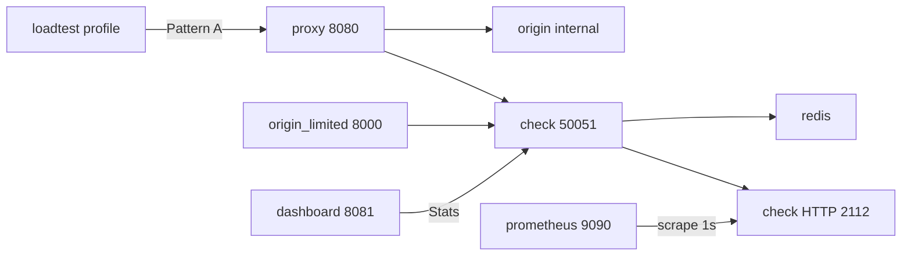

# api-rate-limiter

A standalone rate-limiting/quota service that businesses drop in front of an existing API — as a reverse proxy or as middleware — without changing the API contract.

**Atomic, low-latency limits that survive concurrent load and fail open or closed when Redis is down.**

Full MVP definition: [docs/MVP.md](docs/MVP.md).

## Who it's for

A small-to-mid SaaS team that is hitting abuse or overload, needs Free/Pro/Enterprise quotas, and does not want to own Redis + Lua rate-limit logic.

## Pattern A vs Pattern B

Pick one integration mode. Both call the same Check gRPC service; only *where* the check runs changes.

**Pattern A — reverse proxy.** Run `proxy` in front of an origin that knows nothing about rate limits. The proxy calls Check, then forwards the request byte-for-byte if allowed. Use this when you cannot (or do not want to) change origin code, when you have several origins, or when you want a single choke-point. Demo: host **`:8080`**.

**Pattern B — middleware.** Wrap the origin in-process (Python ASGI/WSGI or Go `net/http` via `pkg/httplimit`). The handler never runs if Check denies. Use this when you already own the app, want per-route costs, or do not want an extra network hop. Demo: host **`:8000`** (`origin-limited`).

A denied request returns HTTP 429 and does not hit origin work. Identity is the `X-API-Key` header in this demo (`free:…` is fail-open, `pro:…` is fail-closed).



## 5-minute live demo (Compose)

Needs Docker (or Podman) Compose. Do **not** also run `make redis` on `:6379` in the same session.

```bash
docker compose up --build
```

(`podman compose up --build` uses the same [compose.yaml](compose.yaml). `make compose-up` uses Docker Compose if the daemon is up, otherwise Podman Compose.)

Then:

1. Open the dashboard: [http://127.0.0.1:8081](http://127.0.0.1:8081)
2. Fire load against Pattern A (does **not** start with default `up` — it would burn the `free:` limit before you look):

```bash
docker compose --profile load run --rm loadtest
# or: make compose-loadtest
```

3. Confirm throttle on the dashboard (`free:` is 20/min). Raw metrics: `curl http://127.0.0.1:2112/metrics`. Prometheus UI: [http://127.0.0.1:9090](http://127.0.0.1:9090) (`api_rate_limiter_requests_total`, `api_rate_limiter_blocked_total`, `api_rate_limiter_redis_up`).
4. Check logs are JSON: `docker compose logs check`
5. Kill Redis and watch fail-open vs fail-closed within a couple of seconds:

```bash
docker compose stop redis
# or: make compose-redis-stop
```

`free:…` still served (fail-open); `pro:…` denied (fail-closed). Dashboard `redis_up` goes false; Prometheus `api_rate_limiter_redis_up` follows. Check stays up (`curl http://127.0.0.1:2112/healthz`).

```bash
docker compose start redis
# or: make compose-redis-start
```

Pattern B without the proxy: `curl -i -H 'X-API-Key: free:demo' http://127.0.0.1:8000/work`. grpcurl against Check: port **50051**.

```bash
docker compose down
# or: make compose-down
```

## Local Makefile loop (secondary)

Needs `protoc`, `protoc-gen-go`, and `protoc-gen-go-grpc` on `PATH`. Generated code is local (`make proto`); it is not committed.

```bash
make redis
make proto
go run ./cmd/check -config configs/check.example.yaml
```

Other terminals: `make run-origin`, `make run-proxy`, `make run-dashboard`, `make loadtest`. Pattern B: `make run-origin-limited` then curl `:8000/work`. Kill Redis: `make redis-stop` / `make redis-start`.

```bash
make test
make test-race
make test-python
```

Python tests: `python3 -m venv python/.venv && python/.venv/bin/pip install -e 'python/[dev]'`.

## Out of scope

This is a signal, not an omission:

- Multi-region / geo-distributed rate limiting
- Billing/payment integration
- Full auth/RBAC for the dashboard or `/metrics`
- Horizontal sharding of the rate-limit store (single Redis is fine for MVP)
- WebSocket/streaming-aware proxying beyond basic passthrough
- Grafana, Loki, OpenTelemetry, Kubernetes/Helm, TLS
