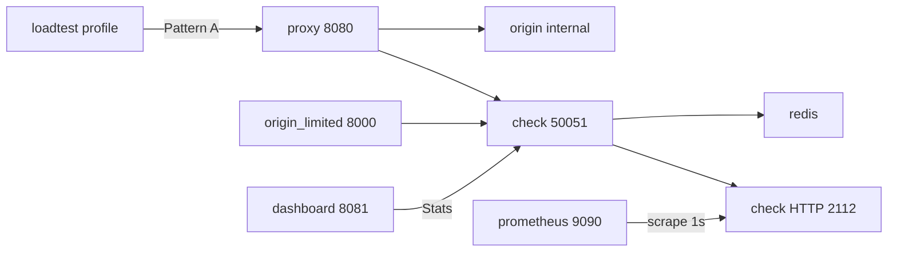

# api-rate-limiter — Architecture

This is the design source of truth for the system as shipped. How to run the demo lives in the [README](../README.md).

## Problem and scope

A small-to-mid SaaS team that already has an HTTP API, is hitting abuse or overload, and needs Free/Pro/Enterprise quotas without owning Redis + Lua rate-limit logic.

The product is a standalone Check service plus adapters. Callers drop it in as a reverse proxy or as in-process middleware. Allowed traffic keeps the origin contract; denied traffic never runs origin work.

**Non-goals** (a signal, not an omission):

- Multi-region / geo-distributed rate limiting
- Billing or payment integration
- Auth/RBAC on the dashboard or `/metrics`
- Horizontal sharding of the rate-limit store (single Redis)
- WebSocket or streaming-aware proxying beyond ordinary HTTP reverse-proxy behavior
- Grafana, Loki, OpenTelemetry, Kubernetes/Helm, TLS on Check gRPC

## System overview

Two integration modes, one Check service. Only *where* the check runs changes.

- **Pattern A — reverse proxy.** `cmd/proxy` sits in front of an origin that knows nothing about rate limits. It calls Check, then reverse-proxies if allowed. Compose publishes this on **`:8080`**.
- **Pattern B — middleware.** The origin wraps itself with Go `net/http` via `pkg/httplimit`. The handler never runs if Check denies. Compose publishes `origin-limited` (`cmd/origin -limited`) on **`:8000`**.

Identity in the demo is the `X-API-Key` header. Prefix `free:` is Redis fail-open (20/min); prefix `pro:` is Redis fail-closed (500/min). There are two independent fail layers: Check ↔ Redis, and adapter ↔ Check.

Process split: only `cmd/check` talks to Redis. Proxy, dashboard, Go middleware, and the limited origin are gRPC clients of `check.v1.Checker` over h2c (insecure credentials, no TLS).

## Design decisions

What was chosen, why, and what that implies.

**Sliding-window counter in Redis + Lua.** Atomic check-and-increment under concurrency without a timestamp log. Token bucket is not implemented; adding it means a second Lua path and a policy field to select it.

**Opaque string keys.** The engine does not interpret API key vs IP vs custom. HTTP adapters extract a string (`header:<name>` or `ip`); Check only does policy lookup on that string.

**Unary gRPC `Check` and `Stats`, h2c.** One Check RPC is the product API. Stats is additive on the same service, not a stream and not a change to `CheckRequest`/`CheckResponse`. Local and Compose demos dial without certs. grpc-go server reflection is on so grpcurl works against **`:50051`**.

**Redis only; counters are ephemeral.** No app SQL. A Redis restart can wipe usage. AOF/RDB is optional ops, not a product requirement. Redis keys are `rl:<key>` hashes with `PEXPIRE` of `2 * window`.

**Policy on disk.** Check loads YAML or JSON: `listen_addr`, optional `metrics_addr`, `redis.addr`, `default`, optional exact `keys`, optional `prefixes`. Proxy and dashboard load YAML only. No admin RPC, no env-var policy overlay.

**Check is the only Redis client.** Adapters must not import `internal/engine` or talk to Redis. Go generated stubs live under `internal/gen/` because of the proto `go_package`; `pkg/httplimit` imports that package, not the limiter.

**Proxy wraps `httputil.ReverseProxy` with `pkg/httplimit`.** Deny/Check-down behavior is not duplicated in `cmd/proxy`. Allowed requests are forwarded by stdlib ReverseProxy (hop-by-hop headers are handled as ReverseProxy always does). Denied requests never reach origin.

**Stats are in-process on Check.** Allowed/blocked totals, last-completed 1s RPS bucket, `redis_up`, and an LRU of at most **50** last-seen keys. Per-key rows are not stored in Redis. Restarting Check zeroes Stats.

**`redis_up` is latched down, pinged up.** Lua/Check store errors set `redis_up` false. A later successful Check does **not** flip it back. A background Redis `PING` (~1s) is what sets it true again.

**Prometheus lives only on Check.** Side HTTP listener (`metrics_addr`, demo **`:2112`**): `/metrics` and `/healthz`. Custom registry, three series, no per-key labels, no default Go collectors. Stats and metrics share `stats.Recorder.Observe`. Proxy, dashboard, and adapters do not export metrics.

**Dashboard is a dumb poller.** Vanilla HTML (`embed.FS`) plus `GET /stats` every 1s; each poll is one unary `Stats` RPC. No SSE, WebSocket, auth, or SPA. HTML is not served from `cmd/check`.

**Proto is generated, not committed.** `make proto` writes `internal/gen/`. Image builds run `protoc` themselves; they do not copy host gen dirs.

**`/healthz` is process up, not Redis up.** Compose must not restart Check when Redis is killed; that *is* the demo. Check still serves fail-open/fail-closed from policy.

**Load-test is a Compose profile, not default `up`.** Default `up` must not burn the `free:` limit before someone opens the dashboard.

## Components

### Engine

`internal/engine/slidingwindow`: embed of `script.lua`, `go-redis` `Eval`.

Approximate sliding window (previous window weighted by time remaining, plus current count):

- Hash fields: `cs` (current window start, ms), `cc` (current count), `pc` (previous count).
- Window start `ws = now - (now % window)`.
- `used = pc * (1 - elapsed/window) + cc`.
- `cost == 0` is a peek: no increment, and no key is created if missing.
- `cost > limit` denies immediately with `retry_after_ms = 0`.
- Admit if `used + cost <= limit`; then `HSET` and `PEXPIRE`.
- Deny returns remaining and `retry_after_ms` as time left in the current window.

Store errors become `engine.Result{StoreFailed: true}` plus allow or deny from `policy.Fail`. That flag is not on the gRPC response.

### Check gRPC

`proto/check/v1/check.proto`, served by `internal/server` / `cmd/check`.

`Check(key, cost) → (allowed, remaining, retry_after_ms)`:

- Empty `key` or `cost < 0` → `InvalidArgument`.
- Policy from `config.Lookup`: exact `keys` entry, else longest matching `prefix`, else `default`.
- Denies log JSON at info (`key`, `remaining`, `retry_after_ms`, `fail`). Allows are not logged (load-test would drown stdout).
- Redis down/up logs on `redis_up` transitions only.

`Stats` returns in-process snapshot: `allowed`, `blocked`, `rps`, `redis_up`, `keys[]` (`key`, `used`, `remaining`, `limit`, `fail`). `used` is `limit - remaining`. Key order is most-recently observed first.

### HTTP adapters

Shared deny contract:

- **429** `{"error":"too_many_requests"}`
- `X-RateLimit-Remaining`
- `Retry-After` in seconds, `ceil(retry_after_ms / 1000)`, omitted when that is 0
- Missing key or Check `InvalidArgument` → **400** `{"error":"bad_request"}`
- Allowed responses get `X-RateLimit-Remaining` and then the origin handler runs

`pkg/httplimit`: `func(http.Handler) http.Handler`. Default key header `X-API-Key`. Unset `Cost` is 0 (peek); callers usually set `Cost: 1` or a `CostFunc`. Adapter `Fail` defaults to **closed** when the Check RPC fails (distinct from Redis fail mode). `Dial` is h2c.

**Proxy** (`cmd/proxy` + `internal/proxyconfig`): YAML `listen_addr`, `origin_url`, `check_addr`, `key` (`header:…` or `ip`), `cost` (default 1), `fail` (default closed). Logs listen, deny, and Check-down.

### Dashboard and load-test

`cmd/dashboard`: YAML listen + Check addr. `GET /` is the page; `GET /stats` JSON. Check unreachable → **502** `{"error":"check unreachable"}`. UI shows rps, allowed/blocked, per-key table, and Redis down copy that names fail-open vs fail-closed.

`cmd/loadtest`: constant-rate **HTTP** against the demo API (not a gRPC flood). Defaults: `http://127.0.0.1:8080/work`, 20 rps, 30s, header `X-API-Key`, keys `free:demo,pro:demo`. Prints allow / 429 / error totals per key.

### Demo origin

`cmd/origin`: `/health` and `/work`, no limiter of its own (Pattern A origin). `-limited` wraps non-health routes with `pkg/httplimit`. `GET /health` skips Check. `-check` / `CHECK_ADDR` (default `127.0.0.1:50051`), cost 1, fail closed, `header:X-API-Key`.

### Observability and packaging

Check HTTP (`internal/checkhttp`) on `metrics_addr`:

| Series | Type | Meaning |
| --- | --- | --- |
| `api_rate_limiter_requests_total` | counter | every Check observation |
| `api_rate_limiter_blocked_total` | counter | not allowed |
| `api_rate_limiter_redis_up` | gauge 0/1 | Redis reachable |

`/healthz` returns `ok\n` while the process is up.

JSON logs: Go `log/slog` `JSONHandler` to stdout, default info. Check: denials, Redis transitions, listen. Proxy: listen, deny, Check-down. Origin: listen; deny and Check-down when `-limited`. Dashboard/loadtest: listen / end report.

Compose (`compose.yaml`): `redis:7-alpine`, `check`, internal `origin`, `proxy` `:8080`, `origin-limited` `:8000`, `dashboard` `:8081`, `prometheus:v3.5.0` `:9090`, Check gRPC `:50051` and metrics `:2112`, Redis `:6379`. `loadtest` is profile `load`. Healthchecks: Redis `PING`, Check `/healthz`, origin `/health`, Prometheus `/-/healthy`. `depends_on` uses `service_healthy` except loadtest → proxy `service_started`.

Images: `deploy/Dockerfile` (Go Alpine, `CGO_ENABLED=0`, wget for healthchecks) with targets `check`, `proxy`, `origin`, `origin-limited`, `dashboard`, `loadtest`. Configs are COPY'd and also bind-mounted from `configs/compose/` so limit tweaks do not require a rebuild. Prometheus scrape interval is **1s** (`configs/compose/prometheus.yml`) so `redis_up` moves on the same timescale as the dashboard.

Go images are Alpine; proto is generated in the build. `.dockerignore` excludes `docs/` and `*.md`.

## Failure behavior

**Redis unreachable (Check layer).** Policy `fail: open` → `allowed=true`, remaining and retry 0. `fail: closed` → `allowed=false`, remaining and retry 0. Dashboard `redis_up` goes false within about a second (PING plus store-error latch). Counters may reset when Redis comes back.

**Check unreachable (adapter layer).** Adapter `fail: open` → origin runs. `fail: closed` (demo default) → 429 with remaining 0 and no `Retry-After`. This is not the Compose kill-Redis demo; killing Check is not a required demo step.

**`/healthz` after Redis death.** Still 200. Do not wire Check health to Redis if you want the fail-mode demo.

## Repo map

| Path | Role |
| --- | --- |
| `proto/check/v1/` | Source of truth for Check + Stats |
| `internal/engine/` | Lua sliding window |
| `internal/config/` | Check YAML/JSON policy |
| `internal/server/` | gRPC service |
| `internal/stats/` | In-process Stats + Prometheus series |
| `internal/checkhttp/` | `/metrics`, `/healthz` |
| `internal/proxyconfig/`, `internal/dashconfig/` | Proxy/dashboard YAML |
| `internal/gen/` | Generated Go stubs (`make proto`, gitignored) |
| `pkg/httplimit` | Exported Go middleware + h2c dial |
| `cmd/check`, `cmd/proxy`, `cmd/origin`, `cmd/dashboard`, `cmd/loadtest` | Binaries |
| `configs/*.example.yaml` | Host `make` loop |
| `configs/compose/` | Service DNS names for Compose |
| `deploy/` | Dockerfile |
| `compose.yaml` | One-command demo |

Local loop (needs `protoc` on `PATH`): `make proto`, `make redis`, `go run ./cmd/check`, plus `run-origin` / `run-proxy` / `run-dashboard` / `loadtest`. Tests use **miniredis**, not a container. Do not run `make redis` on `:6379` in the same session as Compose.

## Correctness

Re-run these if you touch the named area. `make test` / `make test-race`.

| Claim | Where |
| --- | --- |
| N concurrent Checks against limit M admit exactly M (10 runs) | `internal/server/concurrency_test.go` |
| Redis down is fail-open vs fail-closed, not a dead flag | `internal/engine/slidingwindow/limiter_test.go`, `internal/server/failover_test.go` |
| Peek (`cost=0`) does not increment or create a missing key | `limiter_test.go` |
| Window roll / cost > limit | `limiter_test.go` |
| Policy lookup: exact key, longest prefix, default; YAML and JSON | `internal/config/config_test.go` |
| Stats counts, cap 50, store-fail latches `redis_up` | `internal/stats`, `internal/server/stats_test.go` |
| Three Prometheus series only; `/healthz` ignores Redis | `internal/checkhttp/handler_test.go` |
| Adapter allow / 429 / Check-down fail-open\|closed | `pkg/httplimit/middleware_test.go` |
| Proxy deny never hits origin | `cmd/proxy/handler_test.go` |
| Origin `/health` skips Check; `-limited` deny does not run `/work` | `cmd/origin/handler_test.go` |

The live Compose path (dashboard throttle, `compose stop redis`, Prometheus `:9090`, JSON `compose logs check`) is the README demo, not an automated test.

## Future work

Not scheduled. Do not treat this as a commitment to build next.

**Plausible follow-ons** :

- Token bucket as a second algorithm, selectable per key
- Admin RPC/UI to change limits at runtime instead of editing a file
- Multi-tenant dashboard (per-tenant view, not only global)
- API-key issuance (generate a key, tie it to a tier)
- Multi-instance over-admission test (several Check processes, one Redis)

**Still out of scope** unless the product goal changes: multi-region, billing, dashboard/`/metrics` auth, store sharding, streaming-aware proxying, Grafana/Loki/OTel, Kubernetes/Helm, TLS on Check.

If the store had to grow past one Redis, the usual next step is Redis Cluster with consistent hashing on the opaque key — not a second algorithm.
