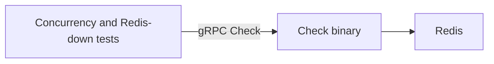

# Milestone 01 — CORE

Week 1. Full product scope: [../MVP.md](../MVP.md).

This document is the checklist for when implementation starts. It is not a request to scaffold code yet.

## Goal

Prove atomic, low-latency `Check` under concurrency, with predictable behavior when Redis is down.

Ship the **Check binary only**. Dashboard, adapters, proxy, and packaging are later milestones.

## Locked decisions

- **Algorithm:** sliding-window counter in Redis + Lua (atomic check-and-increment).
- **RPC:** grpc-go, unary `Check(key, cost) → (allowed, remaining, retry_after_ms)`.
- **Key:** opaque string. The engine does not interpret API key vs IP vs custom.
- **Process split:** Check is its own binary. The dashboard will be a later binary and a gRPC client of Check.
- **Config:** YAML/JSON file — per-key (or prefix/route) limit, window duration, fail-open vs fail-closed. No admin RPC/UI.
- **Datastore:** Redis only. No Postgres/MySQL/SQLite or other persistent app DB. Counters are windowed and may vanish on Redis restart; that is acceptable. Redis AOF/RDB is optional ops, not a product requirement. Config lives on disk as a file.
- **Local gRPC:** h2c (HTTP/2 without TLS) so tests and later middleware can dial without certs.

## Out of scope

- Token bucket
- `Stats` stream / `cmd/dashboard`
- Python/Go middleware, reverse proxy, demo origin API
- Prometheus metrics, JSON logs, Docker Compose demo polish
- C/C++ clients
- Any SQL or persistent app database

## Tasks

Implementation order when coding starts:

1. Proto + codegen for `Check`
2. `internal/` engine: Lua sliding window, opaque string keys, `cost`
3. Config load (limit, window, fail mode)
4. grpc-go Check server (`cmd/check`)
5. Concurrency test: N simultaneous Checks, limit M, assert exactly M allowed (run 10×)
6. Fail-open / fail-closed test with Redis actually down (testcontainers or equivalent)

## Done when

- A client can `Check` against a running Check server.
- Fail-open vs fail-closed is real behavior when Redis is unreachable, not a dead config flag.
- Concurrency test passes reliably (10×, not once).

Bars from [../MVP.md](../MVP.md) success criteria 2–3.
