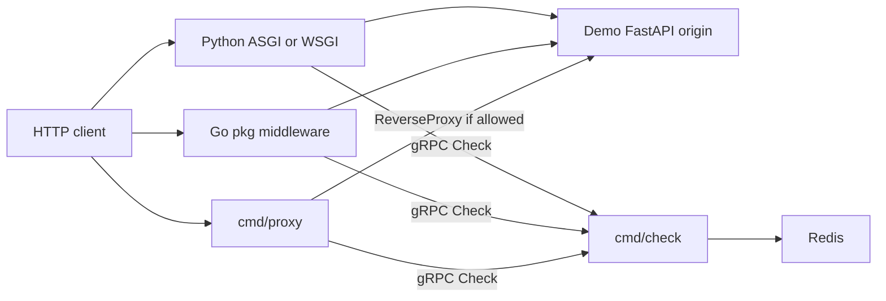

# Milestone 02 — ADAPTERS

Week 2. Full product scope: [../MVP.md](../MVP.md).

This document is the checklist for when implementation starts. It is not a request to scaffold code yet.

## Goal

Prove the "no contract change" story: callers can rate-limit an existing HTTP API via **Pattern A** (reverse proxy) or **Pattern B** (in-process middleware) by calling Check over h2c gRPC.

Ship **adapters + a demo origin**. Dashboard, load-test, Compose, and README storytelling are later milestones.

## Locked decisions

- **Adapters are gRPC clients of Check** (`check.v1.Checker/Check`), h2c, same proto. They do not import `internal/` or talk to Redis.
- **Go middleware:** exported `net/http` middleware in `pkg/` (`func(http.Handler) http.Handler`). Stdlib signature so chi/gorilla/stdlib all work.
- **Python:** one Check client used by **ASGI middleware** (FastAPI/Starlette) and **WSGI middleware** (Flask). Demo origin is FastAPI. Generated Python stubs are local (`make proto` / `grpc_tools.protoc`), not committed — same rule as Go `internal/gen/`.
- **Proxy:** separate `cmd/proxy` binary. `httputil.ReverseProxy` wrapped by the Go middleware so Check + deny behavior is not duplicated. Allowed requests forward byte-for-byte; denied requests never hit origin.
- **Config (proxy):** YAML — listen addr, origin URL, Check addr, key source, default cost, fail-open vs fail-closed **when Check RPC fails**. Example file under `configs/`.
- **Key extraction (HTTP only; engine stays opaque):** `header:<name>` (default `X-API-Key`) or `ip`. Demo keys use existing prefixes in [../../configs/check.example.yaml](../../configs/check.example.yaml) (`free:…`, `pro:…`). Go `KeyFunc` / Python callable for custom keys.
- **cost:** default `1`; optional per-middleware / per-route override. `cost=0` remains Check peek (CORE).
- **Deny:** HTTP **429**, `Retry-After` from `retry_after_ms` (seconds, RFC 9110), `X-RateLimit-Remaining`. Small JSON body; origin contract unchanged for allowed traffic.
- **Check unreachable:** adapter `fail: open|closed` (default **closed**). Distinct from Redis fail mode, which stays inside Check.
- **Demo origin:** small FastAPI app (health + one fake "work" route), **no limiter of its own**. Pattern A = origin behind `cmd/proxy`. Pattern B = same routes wrapped by Python (and a tiny Go `httptest`/example using `pkg/`). No Compose; local run is Redis + `cmd/check` + origin + proxy. Podman-only for Redis, same as CORE.

## Out of scope

- `cmd/dashboard`, Stats stream, load-test script, fail-open/closed **demo polish** (killing Redis mid-demo)
- Docker Compose, Prometheus, JSON logs, README Pattern A vs Pattern B storytelling
- Token bucket, admin RPC/UI, TLS, WebSocket-aware proxying, C/C++ clients
- Changing the Check proto or putting HTTP on Check

## Tasks

Implementation order when coding starts:

1. Shared Go Check dial + key extraction + 429 writer in `pkg/`
2. `net/http` middleware + httptest (allow / 429 / Check-down fail-open|closed)
3. `cmd/proxy` + YAML + example config; wrap ReverseProxy with the middleware
4. Python Check client + ASGI + WSGI; pytest against a fake/local Check
5. Demo FastAPI origin; manual path: proxy in front (A) and middleware-on-origin (B)

## Done when

- Proxy in front of the demo origin throttles at the configured Check policy (429, origin untouched).
- Go and Python middleware can wrap a handler/app and get the same Check result.
- Check-down fail-open vs fail-closed is real in the adapters (not only Redis-down inside Check).

Bars from [../MVP.md](../MVP.md) must-have §3 (adapters + proxy + demo origin). Success criteria 1, 4, 5 wait for Week 3–4.
