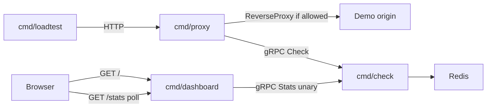

# Milestone 03 — DASHBOARD

Week 3. Full product scope: [../MVP.md](../MVP.md).

This document is the checklist for when implementation starts. It is not a request to scaffold code yet.

## Goal

Prove the live demo loop: load hits the demo API through an adapter, the dashboard shows throttle at the configured limit, and killing Redis shows fail-open vs fail-closed within a couple seconds.

Ship **Stats on Check + `cmd/dashboard` + load-test + kill-Redis glue**. Compose, Prometheus, JSON logs, and README storytelling are later milestones.

## Locked decisions

- **Stats RPC:** unary `Checker.Stats` → `StatsSnapshot` on the existing service, h2c, additive proto only. Do not change `Check` / `CheckRequest` / `CheckResponse`. Not a stream.
- **Stats data:** in-process on Check (not Redis) — allowed/blocked totals, rps (1s bucket), `redis_up`, bounded last-seen per-key map (**cap 50**): used, last remaining, limit, fail mode from existing `config.Lookup`.
- **Redis health:** background PING (~1s) plus latch on Lua/Check Redis errors. `redis_up` is on Stats, not on `CheckResponse`.
- **Dashboard is a gRPC client of Check** (`check.v1.Checker/Stats`), h2c, same proto family as adapters. It does not import `internal/engine` or talk to Redis. HTML is not served from `cmd/check`.
- **Config (dashboard):** YAML — listen addr, Check addr. Example file under `configs/`.
- **Browser:** one HTML page (`embed.FS`, vanilla JS) + **`GET /stats` JSON poll every 1s**. Each poll is one unary Stats RPC. No SSE, no WebSocket, no auth, no SPA. Ordinary HTTP so VPN / sparse monitoring retries next interval; no long-lived stream when the tab is closed.
- **UI:** rps, allowed vs blocked, per-key table, Redis-health indicator **tied to fail-open/closed** (red + which keys still serve vs deny). Functional monitoring view, not a product UI.
- **Load-test:** `cmd/loadtest` — constant-rate HTTP against the **demo API** (Pattern A `cmd/proxy` by default; same binary can hit Pattern B origin-limited). Flags: URL, rate, duration, header (`X-API-Key`). Prints allow vs 429. Not a gRPC flood against Check. Not a load-test UI.
- **Demo keys:** drive `free:…` (fail open) and `pro:…` (fail closed) together, using prefixes in [../../configs/check.example.yaml](../../configs/check.example.yaml).
- **Kill Redis:** Makefile/scripts using existing `CONTAINER` (`redis-stop` / `redis-start`). Mid-load stop must flip `redis_up` and the two fail modes within a couple seconds. Counters may reset on Redis restart (CORE).
- **Fail layers:** this milestone polishes **Check ↔ Redis** (kill Redis). Adapter ↔ Check fail-open/closed stays Week 2; killing `cmd/check` is not a required demo step.
- **Local run:** Redis + `cmd/check` + origin + proxy + dashboard + loadtest. No Compose. Podman-only for Redis, same as CORE.

## Out of scope

- SSE, WebSocket, Stats stream, Grafana
- Docker Compose, Prometheus, JSON logs, README Pattern A vs Pattern B storytelling
- Dashboard auth, multi-tenant views, admin RPC/UI
- Changing `CheckResponse`, putting HTTP on Check
- Token bucket, TLS, C/C++ clients
- Killing Check as a required demo step (adapter fail-open/closed)

## Tasks

Implementation order when coding starts:

1. Proto unary `Stats` + in-process counters + Redis PING inside Check
2. Stats tests: allow/deny counts; `redis_up` false after Redis down (miniredis close or equivalent)
3. `cmd/dashboard` + YAML + example config; `embed.FS` page + `GET /stats`
4. `cmd/loadtest` + Makefile (`run-dashboard`, `loadtest`, `redis-stop`, `redis-start`)
5. Kill-Redis script; manual path: free vs pro keys, dashboard shows both fail modes

## Done when

- A viewer can watch the load-test hit the demo API and see the dashboard throttle at the configured limit (1s poll).
- Killing Redis mid-demo produces fail-open vs fail-closed on the dashboard, visibly, within a couple seconds.

Bars from [../MVP.md](../MVP.md) must-have §4–6. Success criteria 1–2. Criteria 4–5 wait for Week 4.
