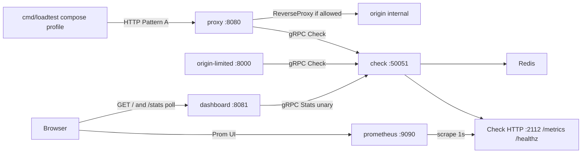

# Milestone 04 — PACKAGING

Week 4. Full product scope: [../MVP.md](../MVP.md).

This document is the checklist for when implementation starts. It is not a request to scaffold code yet.

## Goal

Prove a stranger can `docker compose up` the full live demo in under five minutes, and pick **Pattern A** (proxy) vs **Pattern B** (middleware) from the README.

Ship **Compose + JSON logs + Prometheus + README storytelling**. The dashboard and load-test from Week 3 stay; this week makes that loop one command and inspectable from logs/metrics.

## Locked decisions

- **Compose file:** repo-root [`compose.yaml`](../../compose.yaml) (Compose Specification name). No `version:` key. `docker compose up --build` is the documented path; `podman compose` is the same file. Makefile `CONTAINER` Redis targets stay for the local non-Compose loop.
- **Topology (default `up`):** `redis`, `check`, `origin` (unwrapped, internal), `proxy` (Pattern A, published **8080**), `origin-limited` (Pattern B, published **8000**), `dashboard` (published **8081**), **`prometheus` (published 9090)**. Also publish Check **50051** (grpcurl) and Check metrics **2112**. Redis **6379** stays published so the local Makefile loop can share the same Redis if needed.
- **Load-test is not in default `up`:** a `loadtest` service with Compose **profile `load`**. Default `up` must not burn the `free:` limit before the viewer opens the dashboard. Run: `docker compose run --rm loadtest` (enable the profile in the README/Makefile wrapper). Same flags as today’s `cmd/loadtest` (Pattern A URL by default). Makefile **`make loadtest` stays** for the host Go loop.
- **Images:** `deploy/Dockerfile` Go multi-stage targets (`check`, `proxy`, `dashboard`, `loadtest`); `deploy/Dockerfile.python` targets (`origin`, `origin-limited`). Proto is generated **in the image build**, not copied from gitignored `internal/gen/` / `python/gen/`. Go runtime is **Alpine** (wget for healthchecks), `CGO_ENABLED=0`. Redis image stays `redis:7-alpine`. Prometheus is the official `prom/prometheus` image (no custom Dockerfile).
- **Config in Compose:** YAML files under `configs/compose/` with service DNS names (`redis:6379`, `check:50051`, `http://origin:8000`), plus `prometheus.yml`. Images COPY them; Compose bind-mounts the same files so limit tweaks do not require a rebuild. No new config language and no env-var policy overlay. `origin-limited` keeps `CHECK_ADDR` (already exists).
- **Healthchecks:** Compose `depends_on: condition: service_healthy`. Check `/healthz` is **process up**, not Redis up — Redis-down is the demo, not a restart loop. Origin `/health`. Redis `redis-cli ping`. Prometheus `/-/healthy`. Do not fail Check health when Lua/PING fails.
- **Metrics live only on Check:** `prometheus/client_golang`, HTTP **`GET /metrics`** on a **side listener** (`metrics_addr` in Check YAML, **`:2112`** — the Go instrumentation guide’s scrape port, so **`:9090` is free for the Prometheus UI**). Not on the gRPC port. Not on proxy, dashboard, or adapters. **No per-key labels** (cardinality); per-key stays on Stats/dashboard. Series: `api_rate_limiter_requests_total`, `api_rate_limiter_blocked_total`, `api_rate_limiter_redis_up` (gauge 0/1). Custom registry: these three only (no default Go/process dump on the demo scrape). Instrument from `stats.Recorder` so Stats and `/metrics` share one Observe path. Check proto does not change. `/metrics` is ops HTTP, not a rate-limit API.
- **Prometheus in Compose:** official `prom/prometheus` image in default `up`. Scrape config `configs/compose/prometheus.yml` — job `check`, target `check:2112`, path `/metrics`, **`scrape_interval: 1s`** so `redis_up` moves on the same “couple of seconds” scale as the dashboard (Prometheus’s 15s default would lag the kill-Redis demo). No Grafana, Loki, or OTel collector. Host **`:9090`** is the Prometheus UI; raw exposition remains `curl http://127.0.0.1:2112/metrics`.
- **JSON logs:** Go `log/slog` + `JSONHandler` to **stdout** (12-factor / `compose logs`). Default level **info**. Check logs denials, Redis down/up, and process start — **not** every allow (load-test would drown the demo) and **not** Stats polls. Proxy logs listen + deny/Check-down. Dashboard/loadtest stay quiet except listen/report. Python origin keeps uvicorn’s default access log.
- **README (rewrite in this milestone):** problem, Pattern A vs Pattern B **decision guide**, architecture diagram, 5-minute Compose path (up → dashboard → loadtest → Prometheus `:9090` → `compose stop redis` → both fail modes), local `make` loop as secondary. Out-of-scope list stays a signal. Success criteria 4–5 are the bar.
- **Fail layers unchanged:** kill **Redis** (Check fail-open/closed). Killing Check is still not a required demo step (adapter fail-open/closed is Week 2).

## Out of scope

- Grafana, Loki, OpenTelemetry, Stats stream / SSE / WebSocket
- Kubernetes, Helm, TLS, auth on dashboard or `/metrics`
- Token bucket, admin RPC/UI, C/C++ clients, changing `Check` / `Stats` proto
- Per-key Prometheus labels, HTTP rate-limit API on Check
- Putting policy in environment variables
- Killing Check as a required demo step

## Tasks

Implementation order when coding starts:

1. `slog` JSON on Check (deny + Redis health) and proxy (deny / Check-down); stdout
2. Check `metrics_addr` + `/metrics` + `/healthz`; tests for the three series and Redis-down gauge
3. `deploy/` Dockerfiles, `.dockerignore`, `configs/compose/` (including `prometheus.yml`), root `compose.yaml` with healthchecks
4. README rewrite: Pattern A vs B, architecture, 5-minute Compose path
5. Makefile wrappers (`compose up`, loadtest profile, Redis stop/start via Compose)

## Done when

- Someone unfamiliar with the project can `docker compose up --build` and reach the dashboard in under 5 minutes, per the README.
- Load-test via Compose still shows throttle at the configured limit; `compose stop redis` still shows fail-open vs fail-closed on the dashboard within a couple seconds.
- `curl :2112/metrics` shows the three series; Prometheus at `:9090` is scraping them; `docker compose logs check` is JSON.
- The README Pattern A vs Pattern B section is enough for a non-expert to choose an integration mode.

Bars from [../MVP.md](../MVP.md) must-have §8. Success criteria 4–5. Criteria 1–3 remain true on the Compose path.
